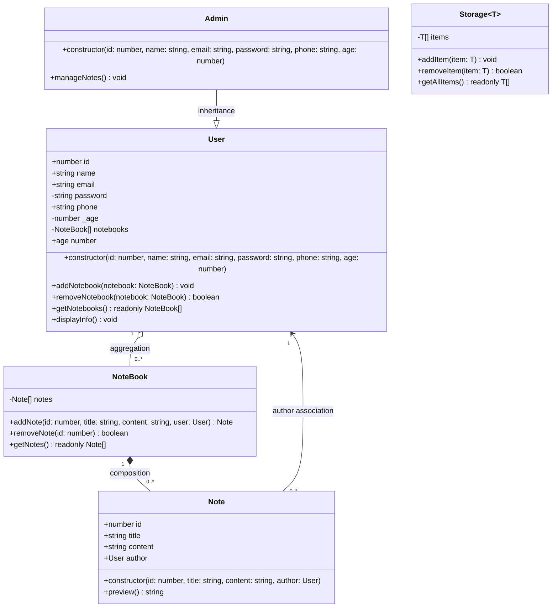



```mermaid
classDiagram
    class User {
        +number id
        +string name
        +string email
        -string password
        +string phone
        -number _age
        -NoteBook[] notebooks
        +constructor(id: number, name: string, email: string, password: string, phone: string, age: number)
        +age number
        +addNotebook(notebook: NoteBook) void
        +removeNotebook(notebook: NoteBook) boolean
        +getNotebooks() readonly NoteBook[]
        +displayInfo() void
    }

    class Admin {
        +constructor(id: number, name: string, email: string, password: string, phone: string, age: number)
        +manageNotes() void
    }

    class Note {
        +number id
        +string title
        +string content
        +User author
        +constructor(id: number, title: string, content: string, author: User)
        +preview() string
    }

    class NoteBook {
        -Note[] notes
        +addNote(id: number, title: string, content: string, user: User) Note
        +removeNote(id: number) boolean
        +getNotes() readonly Note[]
    }

    class Storage~T~ {
        -T[] items
        +addItem(item: T) void
        +removeItem(item: T) boolean
        +getAllItems() readonly T[]
    }

    Admin --|> User : inheritance
    User "1" o-- "0..*" NoteBook : aggregation
    NoteBook "1" *-- "0..*" Note : composition
    Note "0..*" --> "1" User : author association
```

